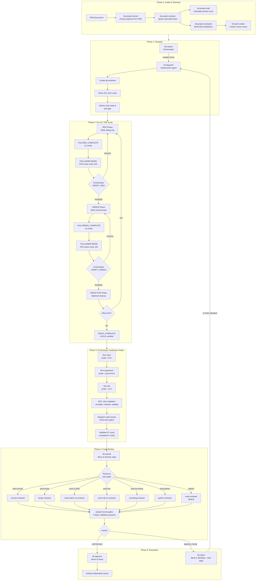
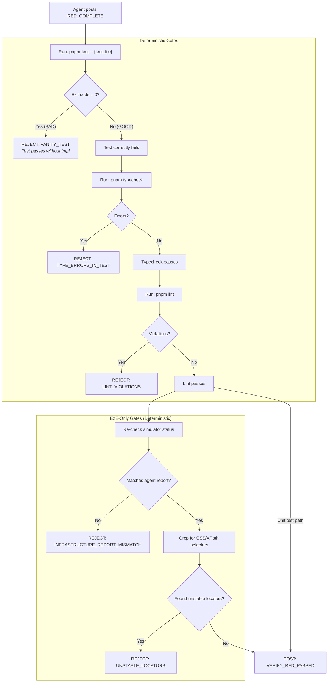
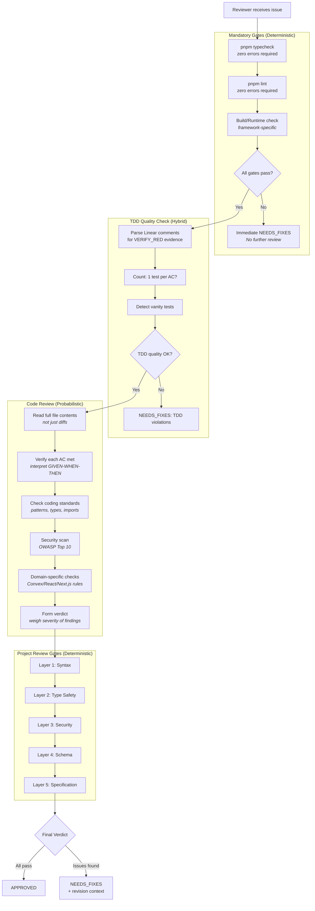
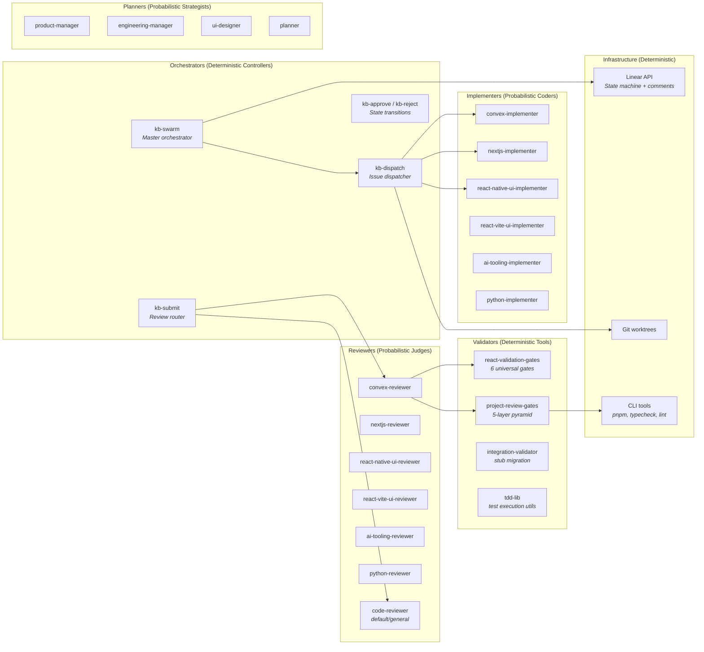

# KB Review Ecosystem Analysis

**Date**: 2026-02-10
**Scope**: Full analysis of `project-review-gates`, `code-review`, `kb-dispatch`, `kb-swarm`, `kb-submit`, `kb-approve`, `kb-reject`, `spec-review-swarm`, `test-review`, and all supporting skills/agents.

---

## 1. System Overview

The KB review ecosystem is a multi-phase software delivery pipeline that orchestrates AI agents through a TDD-enforced workflow. It spans from issue intake through implementation, verification, review, and approval - with Linear (project management) as the coordination backbone and structured comments as the inter-agent protocol.

The system has **three fundamental layers**:

| Layer | Nature | Examples |
|-------|--------|---------|
| **Orchestration** | Deterministic state machine | kb-swarm monitoring loop, Linear state transitions, comment polling |
| **Verification** | Deterministic gate execution | typecheck, lint, test runners, AC count validation |
| **Judgment** | Probabilistic AI reasoning | code-review verdicts, test quality grading, design review, AC interpretation |

---

## 2. Process Map (Mermaid)

### 2.1 End-to-End Pipeline



### 2.2 Orchestrator Verification Detail (VERIFY_RED)



### 2.3 Review Agent Internal Flow



### 2.4 Players Map



---

## 3. Deterministic vs Probabilistic Analysis

### 3.1 Classification Framework

**Deterministic** = Traditional software engineering: the same input always produces the same output. Testable with unit tests. Bugs are logic errors, not judgment errors.

**Probabilistic** = AI judgment: the output depends on LLM reasoning, context interpretation, and heuristic weighing. The same input may produce different outputs across runs. Quality is measured by consistency and calibration, not correctness.

### 3.2 Deterministic Processes

These are the parts where traditional software engineering should be applied. They should be rock-solid, well-tested, and never left to AI judgment.

| Process | Skill/Component | Why Deterministic |
|---------|----------------|-------------------|
| **Linear state transitions** | kb-move, kb-approve, kb-reject, kb-submit | Finite state machine: Backlog → In Progress → Review → Done. Binary transitions with no ambiguity. |
| **Comment polling loop** | kb-dispatch (FOLLOWER MODE) | Poll every 10s, pattern-match for `VERIFY_RED_PASSED` or `VERIFY_RED_FAILED`. Pure string matching. |
| **Comment format parsing** | kb-swarm monitoring loop | Regex/structured parsing of `TDD_PHASE:`, `AC:`, `TEST_FILE:`, etc. Fixed grammar. |
| **Test execution** | Orchestrator VERIFY gates | `pnpm test` returns exit code 0 or non-0. Binary. No interpretation. |
| **Typecheck execution** | All reviewers + orchestrator | `pnpm typecheck` returns errors or clean. Binary. |
| **Lint execution** | All reviewers + orchestrator | `pnpm lint` returns violations or clean. Binary. |
| **Vanity test detection** | VERIFY_RED gate | If test passes (exit 0) without implementation → vanity. Pure logic: exit code check. |
| **AC count validation** | ISSUE_COMPLETE verification | `len(completed_acs) == total_acs`. Arithmetic comparison. |
| **E2E infrastructure check** | VERIFY_RED (E2E path) | `xcrun simctl list`, `curl localhost:8081/status`, `ping`. Binary: up or down. |
| **Locator stability scan** | VERIFY_RED (E2E path) | `grep -c 'getByTestId'` vs `grep -c 'css\|xpath'`. Pattern count comparison. |
| **Infrastructure report mismatch** | VERIFY_GREEN (E2E path) | Compare agent-reported values vs orchestrator-measured values. Equality check. |
| **Flakiness detection** | VERIFY_GREEN (E2E path) | Run test 3 times, `pass_rate < 100%` → flaky. Arithmetic. |
| **Stability metrics mismatch** | VERIFY_GREEN (E2E path) | Compare agent-reported `pass_rate` vs orchestrator-measured. Equality check. |
| **Area-label routing** | kb-submit | `area:convex → convex-reviewer`, `area:ui → react-native-ui-reviewer`. Lookup table. |
| **WSJF calculation** | kb-project-wsjf | `(BV + TC + RR) / multiplier`. Pure arithmetic formula once inputs are set. |
| **Worktree lifecycle** | kb-dispatch, kb-swarm | `git worktree add/remove`. File system operations with deterministic outcomes. |
| **State file tracking** | .kb-swarm-state.json | JSON read/write of session state. CRUD operations. |
| **Dependency unblocking** | kb-approve | When issue moves to Done, query for issues `blockedBy` this one. Graph traversal. |
| **Review gates pyramid** | project-review-gates layers 1-2 | Syntax (parseable?) and Type Safety (typecheck passes?) are binary tool outputs. |
| **Workflow selection** | kb-dispatch code state detection | File missing → CLASSIC_TDD, file exists → GAP_ANALYSIS. File existence check. |
| **WIP limit enforcement** | kb-move | Count issues in state, compare to limit. Arithmetic. |

### 3.3 Probabilistic Processes

These are the parts that are inherently AI tasks - they require judgment, interpretation, and reasoning that doesn't reduce to binary logic.

| Process | Skill/Component | Why Probabilistic |
|---------|----------------|-------------------|
| **Writing test code** | kb-dispatch RED phase | Interpreting a GIVEN-WHEN-THEN AC and producing a test that faithfully captures the intent. Requires understanding of the domain, choosing assertions, mocking strategy. |
| **Writing implementation code** | kb-dispatch GREEN phase | "Minimal code to make the test pass" requires judgment about what's minimal, what patterns to use, how to structure the solution. |
| **Refactoring decisions** | kb-dispatch REFACTOR phase | Identifying duplication, naming improvements, extraction candidates. Aesthetic and structural judgment. |
| **AC interpretation** | All reviewers | Reading "GIVEN a user is logged in WHEN they click profile THEN they see their name" and determining whether the code actually satisfies this. Semantic understanding. |
| **Code quality judgment** | code-review, all domain reviewers | "Is this code clean?" "Does this follow the pattern?" "Is this abstraction appropriate?" These are judgment calls even with standards documents. |
| **Security vulnerability detection** | security-review, all reviewers | Identifying OWASP Top 10 issues requires understanding attack vectors in context. A `user_input` in one context is safe, in another it's XSS. |
| **Test quality grading** | test-review | Assigning A-F grades to test suites. Detecting "vanity tests" that technically pass but don't test real behavior. Requires understanding test intent. |
| **Coding standards interpretation** | code-review | "Context-dependent" rules like `useCallback` being valid only with `React.memo` parent. Requires tracing component relationships. |
| **Design review** | design-reviewer | Evaluating if a mockup is 80%+ aligned with a specification. Visual and conceptual judgment. |
| **PRD/TRD analysis** | spec-review-swarm | Cross-referencing specification documents against codebase implementation. Understanding intent vs. implementation. |
| **WSJF input scoring** | kb-project-wsjf | Business Value (1-10), Time Criticality (1-10), Risk Reduction (1-10) are subjective scores that an AI must assign. The formula is deterministic, the inputs are not. |
| **Implementation planning** | kb-project-analyze | Deciding task breakdown, dependency ordering, agent assignment. Multiple valid decompositions exist. |
| **Revision feedback** | All reviewers (NEEDS_FIXES) | Writing actionable feedback: "what to fix, why, how." Requires understanding the developer's intent and suggesting alternatives. |
| **Cross-track synthesis** | spec-review-swarm | Merging findings from 4 parallel reviewers, resolving conflicts, aggregating severity. Weighting disagreements. |
| **Gap analysis triage** | kb-dispatch GAP_ANALYSIS path | When existing code partially satisfies an AC, deciding whether to augment or rewrite. Judgment call. |
| **Review gates pyramid layers 3-5** | project-review-gates | Security (OWASP interpretation), Schema (migration safety assessment), Specification (TRD compliance) require contextual AI judgment. |
| **Attempt log reasoning** | All reviewers | "What was tried, what failed, what to avoid" requires understanding failure patterns and suggesting novel approaches. |
| **Domain routing edge cases** | kb-submit | When an issue touches multiple areas (e.g., Convex + UI), choosing the primary reviewer requires judgment. |

### 3.4 Hybrid Processes (Deterministic Shell, Probabilistic Core)

These are processes where the **workflow** is deterministic but the **substance** within each step is probabilistic.

| Process | Deterministic Shell | Probabilistic Core |
|---------|--------------------|--------------------|
| **TDD cycle** | RED → GREEN → REFACTOR sequence is fixed | What code to write at each step is AI judgment |
| **Per-AC iteration** | "For each AC, do RED then GREEN" is a loop | Interpreting each AC and producing code is judgment |
| **Reviewer dispatch** | Area label → reviewer mapping is a lookup | The review itself is probabilistic reasoning |
| **Monitoring loop** | "Poll, parse, gate-check, post" is mechanical | code-review dispatch within VERIFY_GREEN is probabilistic |
| **Review gates pyramid** | "Run layers 1-5 in order, fail-fast" is deterministic | Layers 3-5 content analysis is probabilistic |
| **kb-project-analyze** | "Spawn PM, EM, UID → collect → merge" is orchestration | Each agent's analysis is probabilistic |
| **spec-review-swarm** | "Decompose into tracks, dispatch, synthesize" is orchestration | Each track's review is probabilistic |
| **design-review-loop** | "Generate → review → regenerate until approved" is a loop | Review judgment and regeneration are probabilistic |

---

## 4. Architectural Implications

### 4.1 Where to Invest in Traditional Engineering

The deterministic layer is the **load-bearing structure** of the system. Failures here cascade into the probabilistic layer and are hard to diagnose. Invest in:

1. **State machine correctness**: The Linear state transitions (Backlog → In Progress → Review → Done) should be formally modeled and tested. Invalid transitions should be impossible, not just discouraged.

2. **Comment protocol parsing**: The structured comment format (`TDD_PHASE: RED_COMPLETE`, etc.) is the inter-agent communication protocol. A parsing error here breaks the entire feedback loop. This deserves a formal grammar and parser tests.

3. **Gate execution reliability**: `pnpm test`, `pnpm typecheck`, `pnpm lint` are the ground truth. Flaky execution, timeout handling, and exit code interpretation must be bulletproof.

4. **AC count arithmetic**: The `completed_acs == total_acs` check is the final integrity gate. Off-by-one errors or parsing failures here let incomplete work through.

5. **Polling/timeout logic**: The 10-second poll + 5-minute timeout in FOLLOWER MODE is a distributed coordination mechanism. Race conditions, missed messages, and timeout cascades are traditional concurrency bugs.

### 4.2 Where to Invest in AI Quality

The probabilistic layer determines the **output quality** of the system. The code it writes and the reviews it performs are only as good as the prompts, context, and constraints it operates under. Invest in:

1. **Prompt engineering for reviewers**: The adversarial mindset ("assume bugs exist") is calibrated by prompt. Too aggressive → false positives that waste cycles. Too lenient → real bugs slip through.

2. **Context window management**: Reviewers must "read every line" but context windows are finite. The code-review-setup pattern (diff → full file read) is a pragmatic tradeoff. Monitoring whether reviewers actually read vs. skim.

3. **Consistency across runs**: The same code reviewed twice may get different verdicts. For high-stakes decisions (APPROVED vs NEEDS_FIXES), consider requiring consensus from multiple reviewers or using structured checklists to reduce variance.

4. **Feedback quality**: NEEDS_FIXES feedback must be actionable. Vague feedback ("improve error handling") creates expensive re-review cycles. Structured feedback templates help.

5. **Calibration of WSJF inputs**: Business Value, Time Criticality, and Risk Reduction scores are subjective. Track whether AI-assigned scores correlate with actual outcomes to calibrate over time.

### 4.3 The Critical Boundary

The most important architectural boundary is where **deterministic gates guard against probabilistic failures**:

```
Probabilistic: Agent writes code and claims "all tests pass"
                    ↓
Deterministic: Orchestrator ACTUALLY runs tests independently
                    ↓
Deterministic: Exit code 0 or not. No AI involved.
```

This pattern - **never trust the agent's self-assessment, always verify with deterministic tools** - is the fundamental safety mechanism of the system. It appears in:

- Vanity test detection (agent says RED, orchestrator verifies test actually fails)
- Infrastructure report validation (agent says sim is booted, orchestrator re-checks)
- Stability metrics verification (agent says 100% pass rate, orchestrator re-runs)
- AC count validation (agent says "all done", orchestrator counts)

**Any weakening of this boundary is a systemic risk.** If the orchestrator ever trusts an agent's claim without independent verification, the entire quality guarantee collapses.

---

## 5. Risk Analysis

### 5.1 High-Risk Deterministic Failures

| Risk | Impact | Mitigation |
|------|--------|------------|
| Comment parsing breaks silently | Agent stuck in FOLLOWER MODE forever (5min timeout) | Integration tests for all comment formats |
| Linear API rate limiting | Polling loop fails, orchestrator loses sync | Exponential backoff, state recovery from .kb-swarm-state.json |
| Git worktree conflicts | Multiple agents clobber each other's work | Worktree-per-issue isolation (already implemented) |
| Typecheck/lint version drift | Same code passes locally, fails in gate | Pin tool versions, run in consistent environment |

### 5.2 High-Risk Probabilistic Failures

| Risk | Impact | Mitigation |
|------|--------|------------|
| Reviewer approves buggy code | Bug reaches production | Multiple reviewer rounds, project-review-gates as second check |
| Agent writes test that doesn't actually test the AC | False confidence in coverage | test-review skill grades test quality, vanity test detection |
| WSJF scores are miscalibrated | Wrong work prioritized | Track outcomes, recalibrate scoring rubric |
| Reviewer and implementer disagree on AC meaning | Infinite revision loop | AC format standardization (GIVEN-WHEN-THEN), human escalation |
| Code review feedback is vague | Expensive re-review cycles | Structured feedback templates with file:line specificity |

---

## 6. Summary

The KB review ecosystem is a **deterministic orchestration framework with probabilistic actors**. The brilliance of the design is that AI agents are never trusted - they operate inside a cage of deterministic verification gates that independently confirm every claim. The deterministic layer (state machines, polling, parsing, tool execution) should be treated as critical infrastructure with full test coverage. The probabilistic layer (code writing, reviewing, planning) should be treated as a quality optimization problem - measured by consistency, calibration, and outcome tracking rather than binary correctness.

### Classification Ratio

Across the ~45 distinct processes identified in this analysis:

- **~18 (40%) are purely deterministic** - state transitions, tool execution, arithmetic, pattern matching
- **~15 (33%) are purely probabilistic** - code writing, reviewing, planning, judgment
- **~12 (27%) are hybrid** - deterministic workflow wrapping probabilistic substance

The system's reliability comes from ensuring that **every probabilistic output passes through at least one deterministic gate** before being accepted as truth.
